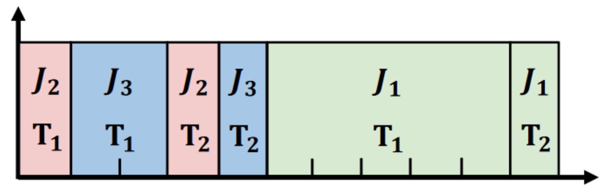

# 实验内容  
论文题目：Fast Distributed Inference Serving for Large Language Models  
原文链接：https://arxiv.org/abs/2305.05920  

&emsp;&emsp;参考论文4.1节中提出的skip-join MLFQ调度算法伪代码（论文第6页Algorithm 1），编程完成“skip-join MLFQ”调度策略仿真和实验（即不进行真实的推理，用sleep一段时间模拟推理过程；此处选用Python作为编程语言），并做实验观察调度器的性能。  
&emsp;&emsp;此调度算法关注的指标是平均任务完成时间average JCT，即所有请求从发送到收到结果的平均时间。如下图所示，J1,J2,J3三个请求同时到达，J2的JCT为4，J3的JCT为5，J1的JCT为11，他们的平均JCT为(4+5+11)/3=6.67。  
  
&emsp;&emsp;编写仿真需要使用多线程。参考经典的Producer-Consumer模型，我们共需要3个线程，简化的流程图如下图所示：  

